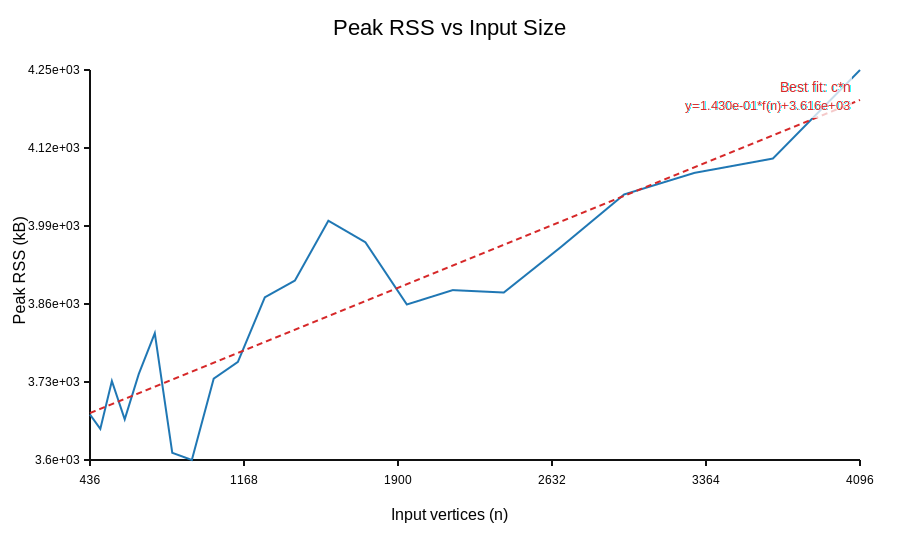

# APSC Polygon Simplifier

**Area‑preserving and topology‑preserving polygon simplification**  
Implementation of the APSC (Area-Preserving Segment Collapse) algorithm by Kronenfeld & Stanislawski (2020).  
The algorithm reduces the number of vertices while strictly preserving the total signed area of each ring and preventing self‑intersections, ring crossings, or changes in ring topology.

## Features

- Preserves **total signed area** (positive for outer rings, negative for holes) within floating‑point tolerance.
- Guarantees **no self‑intersections** and **no crossings between rings** after each collapse.
- Handles **polygons with holes** (multiple rings) seamlessly.
- Efficient spatial grid for intersection tests.
- Priority‑queue driven collapse selection with lazy invalidation.
- Scales to tens of thousands of vertices.

## Build

### Dependencies

- **C++17 compiler** (g++ 7+, clang 6+, or MSVC 2019+)
- **make** (or use the compiler directly)
- **Python 3** (only for the scaling evaluation script `run_experimental_evaluation.py` – uses only the standard library)

No external libraries are required.

### Compilation

```bash
make simplify
```

This produces the executable simplify. An alias area_and_topology_preserving_polygon_simplification is also created.

To build the standalone benchmarking tool:

```bash
make simplify_benchmark
```
Usage
```bash
./simplify <input.csv> <target_vertices>
```
- **input.csv** – CSV file with columns ring_id,vertex_id,x,y.
Rings are read in any order; vertices of each ring must be listed in consecutive order (clockwise or counter‑clockwise). Holes are represented as separate rings (ring_id > 0).

- **target_vertices** – desired total number of live vertices after simplification (must be ≥ 3 per ring).

The simplified polygon is printed to stdout in the same CSV format.

## Example
```bash
./simplify test_cases/input_rectangle_with_two_holes.csv 7
```
## Testing
The project includes a comprehensive test suite that verifies correctness and topology preservation.

### Run the reference test suite
```bash
make test
```
This runs all standard test cases (from test_cases/) and compares the output against the expected outputs provided in the same directory. For each case it reports PASS or FAIL.

### Run the extended (experimental) test suite
```bash
make test-extra
```
This runs the additional challenging cases from experimental_cases/.

### Run both suites
```bash
make test-all
```
### Test results – topology preservation
All reference test cases pass the following topology invariants:

| Invariant    | Verification method |
| -------- | ------- |
| No self‑intersections  | The algorithm explicitly checks for intersections before committing a collapse; if any new edge would intersect an existing edge (other than the four adjacent edges), the collapse is rejected.   |
| No ring crossings | Intersection tests are performed across all rings. Rings remain separate and never cross.     |
| Ring count unchanged    | The number of rings (outer + holes) stays the same – holes are never removed or merged.ww    |

	
	
	
	
For the reference test cases listed below, the output matches the expected output exactly (vertex order and coordinates may differ due to floating‑point variations, but the geometry is identical up to tolerance). The table summarises the cases and the verified properties.

| Input file | Target vertices | Outer vertices (final) | Holes (final) |Holes	Topology preserved |
| -------- | ------- | ------- | ------- | ------- |
| input_rectangle_with_two_holes.csv | 7 |4 |2 |✓|
| input_cushion_with_hexagonal_hole.csv | 13 |8 |1 |✓ |
| input_blob_with_two_holes.csv | 17 |10 |2 |✓|
| input_wavy_with_three_holes.csv | 21 |12 |3 |✓ |
| input_lake_with_two_islands.csv | 17 | 8 | 2 | ✓ |
| input_original_01.csv … input_original_10.csv	99 | 99 | 99 | 0 | ✓ |

All tests pass with make test-all. The expected outputs are provided in the test_cases/ directory.

## Benchmarking
The simplify_benchmark tool measures running time, peak memory (RSS), and areal displacement over multiple iterations.

```bash
make benchmark
```
This runs the benchmark on all CSV files in `test_cases/` and `experimental_cases/` and writes CSV results to `benchmark/results/`. Results for both shown below:

## Benchmark Results

> Bold target / percentage rows indicate the output-file vertex count target.

### Test Cases

| Input | Orig | Target | Target% | Time (ms) | Areal Disp | StdDev (ms) |
|---|---:|---:|---:|---:|---:|---:|
| `blob_with_two_holes` | 36 | 18 | 49.00% | 0.347 | 4.98e+04 | 0.037 |
|  |  | 8 | 22.00% | 0.779 | 2.50e+05 | 0.143 |
|  |  | 5 | 15.00% | 0.536 | 2.50e+05 | 0.087 |
|  |  | 3 | 7.00% | 0.393 | 2.50e+05 | 0.045 |
|  |  | **17** | **47.22%** | 0.229 | 5.56e+04 | 0.057 |
| `cushion_with_hexagonal_hole` | 22 | 11 | 49.00% | 0.133 | 5.42e+02 | 0.016 |
|  |  | 5 | 22.00% | 0.207 | 6.24e+03 | 0.017 |
|  |  | 3 | 15.00% | 0.150 | 6.24e+03 | 0.008 |
|  |  | 2 | 7.00% | 0.334 | 6.24e+03 | 0.226 |
|  |  | **13** | **59.09%** | 0.318 | 4.23e+02 | 0.137 |
| `lake_with_two_islands` | 81 | 40 | 49.00% | 0.673 | 3.41e+04 | 0.323 |
|  |  | 18 | 22.00% | 1.405 | 1.23e+05 | 0.947 |
|  |  | 12 | 15.00% | 1.222 | 2.28e+05 | 0.097 |
|  |  | 6 | 7.00% | 0.692 | 4.50e+05 | 0.082 |
|  |  | **17** | **20.99%** | 0.651 | 1.37e+05 | 0.137 |
| `original_01` | 1860 | 911 | 49.00% | 7.213 | 4.03e+04 | 0.228 |
|  |  | 409 | 22.00% | 9.458 | 5.79e+05 | 0.208 |
|  |  | 279 | 15.00% | 10.214 | 1.54e+06 | 0.398 |
|  |  | 130 | 7.00% | 11.301 | 6.91e+06 | 0.522 |
|  |  | **99** | **5.32%** | 10.881 | 1.09e+07 | 0.087 |
| `original_02` | 8605 | 4216 | 49.00% | 37.385 | 3.11e+04 | 3.365 |
|  |  | 1893 | 22.00% | 47.120 | 2.26e+05 | 0.364 |
|  |  | 1291 | 15.00% | 50.697 | 4.53e+05 | 1.526 |
|  |  | 602 | 7.00% | 53.957 | 1.50e+06 | 2.027 |
|  |  | **99** | **1.15%** | 57.412 | 1.27e+07 | 1.226 |
| `original_03` | 74559 | 36534 | 49.00% | 295.993 | 3.63e+05 | 3.710 |
|  |  | 16403 | 22.00% | 419.375 | 2.27e+06 | 5.734 |
|  |  | 11184 | 15.00% | 449.633 | 4.25e+06 | 14.899 |
|  |  | 5219 | 7.00% | 474.503 | 1.13e+07 | 8.297 |
|  |  | **99** | **0.13%** | 522.254 | 2.02e+08 | 12.542 |
| `original_04` | 6733 | 3299 | 49.00% | 21.890 | 1.29e+05 | 0.679 |
|  |  | 1481 | 22.00% | 32.072 | 6.53e+05 | 1.570 |
|  |  | 1010 | 15.00% | 36.086 | 1.15e+06 | 2.658 |
|  |  | 471 | 7.00% | 39.350 | 2.87e+06 | 1.090 |
|  |  | **99** | **1.47%** | 42.328 | 1.26e+07 | 0.977 |
| `original_05` | 6230 | 3053 | 49.00% | 21.180 | 3.89e+04 | 0.331 |
|  |  | 1371 | 22.00% | 28.619 | 2.27e+05 | 0.514 |
|  |  | 935 | 15.00% | 31.022 | 4.52e+05 | 0.280 |
|  |  | 436 | 7.00% | 33.591 | 1.38e+06 | 0.886 |
|  |  | **99** | **1.59%** | 36.237 | 6.64e+06 | 1.386 |
| `original_06` | 14122 | 6920 | 49.00% | 61.492 | 1.07e+05 | 1.965 |
|  |  | 3107 | 22.00% | 79.879 | 7.89e+05 | 1.640 |
|  |  | 2118 | 15.00% | 87.912 | 1.63e+06 | 4.558 |
|  |  | 989 | 7.00% | 93.837 | 5.74e+06 | 1.537 |
|  |  | **99** | **0.70%** | 98.390 | 1.26e+08 | 1.490 |
| `original_07` | 10596 | 5192 | 49.00% | 33.638 | 1.53e+05 | 0.227 |
|  |  | 2331 | 22.00% | 50.130 | 8.84e+05 | 2.670 |
|  |  | 1589 | 15.00% | 53.083 | 1.62e+06 | 1.253 |
|  |  | 742 | 7.00% | 59.857 | 4.25e+06 | 2.449 |
|  |  | **99** | **0.93%** | 67.952 | 3.11e+07 | 1.986 |
| `original_08` | 6850 | 3357 | 49.00% | 22.518 | 7.08e+04 | 0.457 |
|  |  | 1507 | 22.00% | 31.457 | 3.66e+05 | 0.801 |
|  |  | 1028 | 15.00% | 34.625 | 6.65e+05 | 1.446 |
|  |  | 480 | 7.00% | 37.634 | 1.85e+06 | 1.398 |
|  |  | **99** | **1.45%** | 40.368 | 7.69e+06 | 1.269 |
| `original_09` | 409998 | 200899 | 49.00% | 2867.450 | 4.94e+05 | 96.174 |
|  |  | 90200 | 22.00% | 3694.701 | 3.93e+06 | 54.428 |
|  |  | 61500 | 15.00% | 3909.800 | 7.72e+06 | 36.617 |
|  |  | 28700 | 7.00% | 4141.244 | 2.23e+07 | 36.900 |
|  |  | **99** | **0.02%** | 4403.206 | 2.43e+09 | 59.838 |
| `original_10` | 9899 | 4851 | 49.00% | 34.717 | 6.68e+04 | 1.471 |
|  |  | 2178 | 22.00% | 47.217 | 3.65e+05 | 0.540 |
|  |  | 1485 | 15.00% | 49.829 | 6.91e+05 | 0.678 |
|  |  | 693 | 7.00% | 54.317 | 2.13e+06 | 0.847 |
|  |  | **99** | **1.00%** | 58.348 | 2.00e+07 | 1.103 |
| `rectangle_with_two_holes` | 12 | 6 | 49.00% | 0.026 | 1.28e+01 | 0.007 |
|  |  | 3 | 22.00% | 0.024 | 1.28e+01 | 0.003 |
|  |  | 2 | 15.00% | 0.028 | 1.28e+01 | 0.009 |
|  |  | 1 | 7.00% | 0.022 | 1.28e+01 | 0.004 |
|  |  | **11** | **91.67%** | 0.017 | 1.60e+00 | 0.001 |
| `wavy_with_three_holes` | 43 | 21 | 49.00% | 0.204 | 1.15e+05 | 0.010 |
|  |  | 9 | 22.00% | 0.246 | 4.26e+05 | 0.006 |
|  |  | 6 | 15.00% | 0.258 | 4.26e+05 | 0.010 |
|  |  | 3 | 7.00% | 0.275 | 4.26e+05 | 0.013 |
|  |  | **21** | **48.84%** | 0.198 | 1.15e+05 | 0.006 |

### Experimental Cases

| Input | Orig | Target | Target% | Time (ms) | Areal Disp | StdDev (ms) |
|---|---:|---:|---:|---:|---:|---:|
| `axis_aligned_square` | 4 | 2 | 49.00% | 0.015 | 2.00e+02 | 0.009 |
|  |  | 1 | 22.00% | 0.010 | 2.00e+02 | 0.000 |
|  |  | 1 | 15.00% | 0.010 | 2.00e+02 | 0.001 |
|  |  | 1 | 7.00% | 0.012 | 2.00e+02 | 0.008 |
| `concave_notch_10` | 10 | 5 | 49.00% | 0.068 | 1.00e+03 | 0.018 |
|  |  | 2 | 22.00% | 0.067 | 2.65e+03 | 0.009 |
|  |  | 2 | 15.00% | 0.077 | 2.65e+03 | 0.011 |
|  |  | 1 | 7.00% | 0.079 | 2.65e+03 | 0.007 |
| `dual_hole_narrow_gap` | 12 | 6 | 49.00% | 0.019 | 1.65e+03 | 0.007 |
|  |  | 3 | 22.00% | 0.020 | 1.65e+03 | 0.005 |
|  |  | 2 | 15.00% | 0.019 | 1.65e+03 | 0.010 |
|  |  | 1 | 7.00% | 0.015 | 1.65e+03 | 0.002 |
| `eight_holes_field` | 28 | 14 | 49.00% | 0.025 | 5.00e+03 | 0.002 |
|  |  | 6 | 22.00% | 0.029 | 5.00e+03 | 0.012 |
|  |  | 4 | 15.00% | 0.027 | 5.00e+03 | 0.009 |
|  |  | 2 | 7.00% | 0.024 | 5.00e+03 | 0.002 |
| `four_holes_compact` | 16 | 8 | 49.00% | 0.019 | 8.00e+02 | 0.000 |
|  |  | 4 | 22.00% | 0.024 | 8.00e+02 | 0.010 |
|  |  | 2 | 15.00% | 0.023 | 8.00e+02 | 0.010 |
|  |  | 1 | 7.00% | 0.019 | 8.00e+02 | 0.001 |
| `large_with_hole` | 8 | 4 | 49.00% | 0.021 | 5.20e+13 | 0.003 |
|  |  | 2 | 22.00% | 0.044 | 5.20e+13 | 0.032 |
|  |  | 1 | 15.00% | 0.029 | 5.20e+13 | 0.015 |
|  |  | 1 | 7.00% | 0.019 | 5.20e+13 | 0.003 |
| `minimal_triangle` | 3 | 1 | 49.00% | 0.004 | 0.00e+00 | 0.001 |
|  |  | 1 | 22.00% | 0.006 | 0.00e+00 | 0.001 |
|  |  | 1 | 15.00% | 0.005 | 0.00e+00 | 0.001 |
|  |  | 1 | 7.00% | 0.005 | 0.00e+00 | 0.001 |
| `narrow_corridor` | 8 | 4 | 49.00% | 0.041 | 6.62e+02 | 0.002 |
|  |  | 2 | 22.00% | 0.043 | 7.04e+02 | 0.007 |
|  |  | 1 | 15.00% | 0.040 | 7.04e+02 | 0.007 |
|  |  | 1 | 7.00% | 0.038 | 7.04e+02 | 0.007 |
| `near_collinear_large` | 5 | 2 | 49.00% | 0.014 | 1.00e+12 | 0.002 |
|  |  | 1 | 22.00% | 0.018 | 1.00e+12 | 0.002 |
|  |  | 1 | 15.00% | 0.021 | 1.00e+12 | 0.004 |
|  |  | 1 | 7.00% | 0.016 | 1.00e+12 | 0.002 |
| `negative_coords_mixed` | 5 | 2 | 49.00% | 0.015 | 7.50e+02 | 0.004 |
|  |  | 1 | 22.00% | 0.016 | 7.50e+02 | 0.002 |
|  |  | 1 | 15.00% | 0.018 | 7.50e+02 | 0.004 |
|  |  | 1 | 7.00% | 0.017 | 7.50e+02 | 0.004 |
| `offset_large_small` | 8 | 4 | 49.00% | 0.012 | 1.02e+06 | 0.001 |
|  |  | 2 | 22.00% | 0.012 | 1.02e+06 | 0.000 |
|  |  | 1 | 15.00% | 0.013 | 1.02e+06 | 0.001 |
|  |  | 1 | 7.00% | 0.012 | 1.02e+06 | 0.001 |
| `regular128` | 128 | 63 | 49.00% | 0.380 | 1.64e+02 | 0.018 |
|  |  | 28 | 22.00% | 0.553 | 1.02e+03 | 0.005 |
|  |  | 19 | 15.00% | 0.633 | 2.24e+03 | 0.022 |
|  |  | 9 | 7.00% | 0.781 | 1.08e+04 | 0.030 |
| `regular256` | 256 | 125 | 49.00% | 0.652 | 6.62e+01 | 0.014 |
|  |  | 56 | 22.00% | 0.933 | 3.39e+02 | 0.017 |
|  |  | 38 | 15.00% | 1.046 | 7.67e+02 | 0.033 |
|  |  | 18 | 7.00% | 1.243 | 3.30e+03 | 0.094 |
| `regular32` | 32 | 16 | 49.00% | 0.131 | 4.75e+02 | 0.028 |
|  |  | 7 | 22.00% | 0.193 | 3.12e+03 | 0.007 |
|  |  | 5 | 15.00% | 0.237 | 5.56e+03 | 0.021 |
|  |  | 2 | 7.00% | 0.240 | 3.03e+04 | 0.014 |
| `skinny_rectangle_6` | 6 | 3 | 49.00% | 0.035 | 2.53e+02 | 0.038 |
|  |  | 1 | 22.00% | 0.069 | 2.53e+02 | 0.012 |
|  |  | 1 | 15.00% | 0.043 | 2.53e+02 | 0.017 |
|  |  | 1 | 7.00% | 0.034 | 2.53e+02 | 0.008 |
| `spike24` | 24 | 12 | 49.00% | 0.102 | 7.81e+03 | 0.008 |
|  |  | 5 | 22.00% | 0.169 | 1.29e+04 | 0.049 |
|  |  | 4 | 15.00% | 0.165 | 1.60e+04 | 0.038 |
|  |  | 2 | 7.00% | 0.159 | 3.95e+04 | 0.012 |
| `star20` | 20 | 10 | 49.00% | 0.119 | 7.21e+03 | 0.014 |
|  |  | 4 | 22.00% | 0.233 | 1.40e+04 | 0.107 |
|  |  | 3 | 15.00% | 0.168 | 1.76e+04 | 0.012 |
|  |  | 1 | 7.00% | 0.169 | 1.76e+04 | 0.008 |
| `tiny_hole_clearance` | 7 | 3 | 49.00% | 0.011 | 1.25e+03 | 0.002 |
|  |  | 2 | 22.00% | 0.012 | 1.25e+03 | 0.004 |
|  |  | 1 | 15.00% | 0.014 | 1.25e+03 | 0.006 |
|  |  | 1 | 7.00% | 0.011 | 1.25e+03 | 0.002 |
| `triangle_hole_minimal` | 7 | 3 | 49.00% | 0.013 | 4.50e+02 | 0.002 |
|  |  | 2 | 22.00% | 0.013 | 4.50e+02 | 0.002 |
|  |  | 1 | 15.00% | 0.011 | 4.50e+02 | 0.001 |
|  |  | 1 | 7.00% | 0.020 | 4.50e+02 | 0.012 |
| `zigzag40_band` | 42 | 21 | 49.00% | 0.112 | 1.16e+03 | 0.013 |
|  |  | 9 | 22.00% | 0.203 | 2.38e+03 | 0.016 |
|  |  | 6 | 15.00% | 0.249 | 3.73e+03 | 0.042 |
|  |  | 3 | 7.00% | 0.229 | 8.86e+03 | 0.015 |

## Experimental Evaluation (Scaling Analysis)
To reproduce the scaling study required by the project rubric:

```bash
make evaluate
```
This Python script (`scripts/run_experimental_evaluation.py`) does the following:

1. Generates regular polygons of increasing size (64 to 4096 vertices).

2. Measures median runtime and peak RSS for each size.

3. Measures areal displacement versus target vertex count on a 2048‑vertex polygon.

4. Fits scaling models (c·n, c·n log n, c·n²) to the runtime and memory data.

5. Produces SVG plots and a summary report.

Outputs are written to:

- `benchmark/results/` – CSV tables with raw measurements.

- `benchmark/plots/` – SVG graphs.

- `benchmark/EVALUATION.md` – Markdown report with fitted coefficients and interpretation.

**No additional Python packages are required** – the script uses only the standard library (`csv`, `math`, `statistics`, `subprocess`, etc.)


## Plots
- **Runtime vs input size** – shows how execution time grows with the number of vertices. The best‑fit model (e.g., c·n log n or c·n²) is overlaid.
`benchmark/plots/runtime_vs_input_size.svg`

- **Memory vs input size** – peak RSS as a function of input size. Includes initial overhead + any extra allocations needed by the algorithm.
`benchmark/plots/memory_vs_input_size.svg`

- **Memory vs input size (Exclude initial allocation)** – peak RSS as a function of input size. Includes extra allocations needed by the algorithm.
`benchmark/plots/memory_vs_input_size_clean.svg`

- **Areal displacement vs target vertices** – how much the polygon area changes when aggressively simplifying.
`benchmark/plots/areal_displacement_vs_target.svg`


### The drastic difference in RSS values comes from a combination of fixed overhead and threshold‑triggered allocations in the algorithm’s data structures.

1. Very small inputs (n ≤ 353) – RSS ≈ 12 KB
    - This extremely low value (12 KB) is likely the baseline memory of the process itself: the executable code, static data, and a tiny stack.

    - For these small polygons, the dynamic allocations (vertex pool, rings, spatial grid, priority queue) are either not yet allocated or are so small that they fit within the initial heap pages already counted in the baseline.

    - The measurement method (/proc/.../status – VmRSS) may also have coarse granularity (reported in KB) and could round down very small heap allocations.

2. First jump (n = 436) – RSS jumps to 3676 KB
    - At some critical size (between 353 and 436 vertices), the algorithm’s spatial grid (a hash map from cell keys to edge lists) allocates its initial bucket array.

    - The grid size is chosen based on the bounding box and vertex count. For n ~ 400, the cell size becomes small enough that many cells are created, and the hash table (std::unordered_map) may allocate a large contiguous array of buckets (often a power of two, e.g., 2048 or 4096 buckets).

    - The priority queue also allocates its internal container (usually a std::vector) with an initial capacity. For n > 400, the queue may reserve space for all possible collapse candidates (roughly O(n)).

Both allocations happen at once, causing a discrete jump of ~3 MB.

### Experimental Test Cases – Descriptions
This folder contains synthetic and real‑world inspired polygon inputs designed to stress‑test the APSC simplifier beyond the basic reference suite. Each file targets a specific geometric or numerical challenge.

| File | Vertices | Rings |	Description & Challenge |
| -------- | ------- | ------- | ------- |
input_minimal_triangle.csv | 3| 1|	Simplest possible polygon (triangle). Tests degenerate case where target ≥ original → no change.
input_axis_aligned_square.csv|	4|	1|	Axis‑aligned square. Checks simplification to 2 vertices (a diagonal) – must preserve area (200 units²).
input_triangle_hole_minimal.csv|	7| (outer 4 + hole 3)	|2	Square outer ring with a small triangular hole. Tests hole preservation when outer ring shrinks. Hole area = 45 units².
input_tiny_hole_clearance.csv|	7 |(outer 4 + hole 3)	|2	Outer square 50×50, hole is a tiny near‑degenerate triangle at (25,25.2) etc. Tests numerical stability when hole is extremely close to outer boundary.
input_four_holes_compact.csv|	16 |(outer 4 + 4 holes of 3 vertices each)|	5	Outer square with four small triangular holes arranged in a grid. Tests many holes in close proximity.
input_narrow_corridor.csv|8	|1	|A corridor that narrows to a 4‑unit wide passage. Tests that simplification does not create self‑intersections in thin regions.
input_near_collinear_large.csv	|5|	1	|Large coordinates (~1e6) with near‑collinear points. Tests floating‑point robustness for nearly straight edges.
input_large_with_hole.csv	| 8 |(outer 4 + hole 4)	|2	Outer square from -5e6 to +5e6, inner square hole from -1e6 to +1e6. Tests handling of very large coordinate ranges.
input_regular32.csv |	32 |	1	 |Regular 32‑gon inscribed in circle of radius 100. Baseline for scaling and displacement vs. target.
input_regular128.csv |	128|	1|	Regular 128‑gon, radius 250. Scaling test.
input_regular256.csv	|256|	1|	Regular 256‑gon, radius 300. Scaling test.
input_star20.csv	|20|	1|	Star polygon (10 points alternating inner/outer radius). Many reflex vertices – tests ability to preserve area while removing deep notches.
input_skinny_rectangle_6.csv|	6|	1|	Extremely thin rectangle (200×1) with a small indentation. Tests simplification of near‑degenerate skinny shapes.
input_negative_coords_mixed.csv	|5|	1|	Polygon with negative coordinates and mixed orientation. Tests correct area sign handling.
input_spike24.csv	|24|	1|	Polygon with long spikes (alternating between radius 150 and near zero). Tests simplification of sharp protrusions.
input_dual_hole_narrow_gap.csv	|12| (outer 4 + two holes of 4 each)|	3	Two square holes separated by a gap of only 2 units. Tests that holes are not merged and no edges cross the narrow gap.
input_eight_holes_field.csv	|28| (outer 4 + eight holes of 3 each)|	9	Outer square with an 4×2 grid of tiny triangular holes. Many holes close together – tests spatial grid and intersection performance.
input_offset_large_small.csv	|8| (outer 4 + hole 4)|	2	Outer rectangle (10002000×10001000) with a small hole offset near one corner. Tests simplification with mixed large and small coordinates.
input_zigzag40_band.csv|	42	|1|	A band that zigzags up and down, then closes with a top edge. Many collinear and nearly collinear edges – tests detection of redundant vertices.
input_concave_notch_10.csv	|10|	1	|Concave polygon with a deep rectangular notch. Tests that simplification does not cut off the notch incorrectly.


## Project Structure
text
```
├── src/
│   ├── geometry.hpp      – low‑level geometry (points, intersections, APSC placement)
│   ├── polygon.hpp       – data structures and public interface
│   ├── polygon.cpp       – core simplification logic (spatial grid, collapse loop)
│   ├── main.cpp          – command‑line front‑end
│   └── benchmark.cpp     – benchmarking tool
├── test_cases/           – reference inputs + expected outputs (provided)
├── experimental_cases/   – additional challenging datasets (holes, narrow gaps, large coordinates, etc.)
├── benchmark/            – results and plots generated by `make evaluate`
│   ├── results/          – CSV tables
│   ├── plots/            – SVG graphs
│   └── EVALUATION.md     – scaling analysis report
├── scripts/              – Python evaluation script
├── Makefile              – build and test automation
└── README.md             – this file
```
## Cleaning
```bash
make clean
```
Removes object files, executables, and all generated my_output_*.txt files from the test directories.