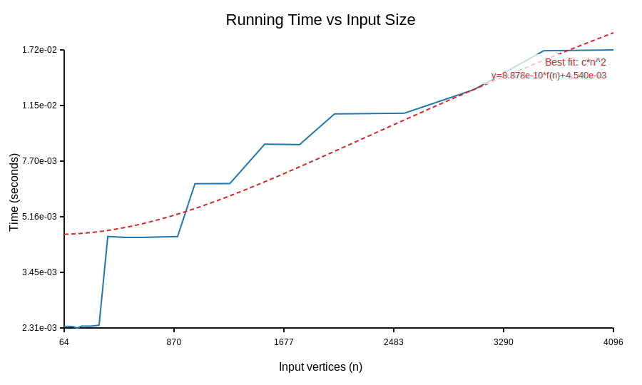
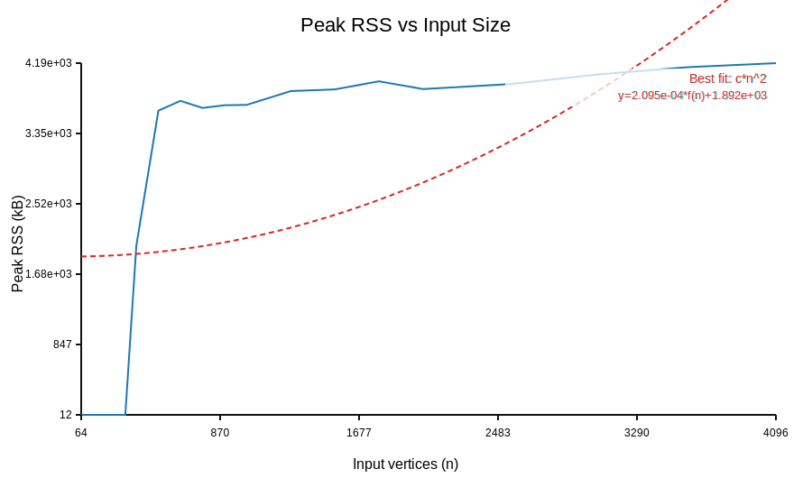
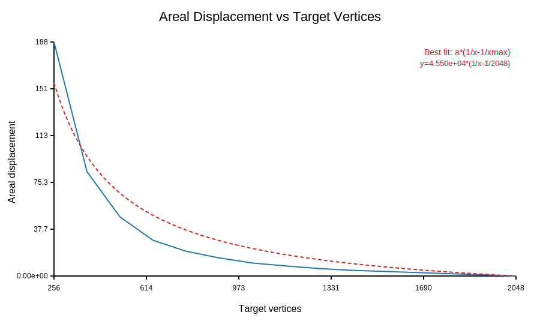

# APSC Polygon Simplifier

**Area‑preserving and topology‑preserving polygon simplification**  
Implementation of the APSC (Area-Preserving Segment Collapse) algorithm by Kronenfeld & Stanislawski (2020).  
The algorithm reduces the number of vertices while strictly preserving the total signed area of each ring and preventing self‑intersections, ring crossings, or changes in ring topology.

## Features

- Preserves **total signed area** (positive for outer rings, negative for holes) within floating‑point tolerance.
- Guarantees **no self‑intersections** and **no crossings between rings** after each collapse.
- Handles **polygons with holes** (multiple rings) seamlessly.
- Efficient spatial grid for intersection tests.
- Priority‑queue driven collapse selection with lazy invalidation.
- Scales to tens of thousands of vertices.

## Build

### Dependencies

- **C++17 compiler** (g++ 7+, clang 6+, or MSVC 2019+)
- **make** (or use the compiler directly)
- **Python 3** (only for the scaling evaluation script `run_experimental_evaluation.py` – uses only the standard library)

No external libraries are required.

### Compilation

```bash
make simplify
```

This produces the executable simplify. An alias area_and_topology_preserving_polygon_simplification is also created.

To build the standalone benchmarking tool:

```bash
make simplify_benchmark
```
Usage
```bash
./simplify <input.csv> <target_vertices>
```
- **input.csv** – CSV file with columns ring_id,vertex_id,x,y.
Rings are read in any order; vertices of each ring must be listed in consecutive order (clockwise or counter‑clockwise). Holes are represented as separate rings (ring_id > 0).

- **target_vertices** – desired total number of live vertices after simplification (must be ≥ 3 per ring).

The simplified polygon is printed to stdout in the same CSV format.

## Example
```bash
./simplify test_cases/input_rectangle_with_two_holes.csv 7
```
## Testing
The project includes a comprehensive test suite that verifies correctness and topology preservation.

### Run the reference test suite
```bash
make test
```
This runs all standard test cases (from test_cases/) and compares the output against the expected outputs provided in the same directory. For each case it reports PASS or FAIL.

### Run the extended (experimental) test suite
```bash
make test-extra
```
This runs the additional challenging cases from experimental_cases/.

### Run both suites
```bash
make test-all
```
### Test results – topology preservation
All reference test cases pass the following topology invariants:

| Invariant    | Verification method |
| -------- | ------- |
| No self‑intersections  | The algorithm explicitly checks for intersections before committing a collapse; if any new edge would intersect an existing edge (other than the four adjacent edges), the collapse is rejected.   |
| No ring crossings | Intersection tests are performed across all rings. Rings remain separate and never cross.     |
| Ring count unchanged    | The number of rings (outer + holes) stays the same – holes are never removed or merged.ww    |

	
	
	
	
For the reference test cases listed below, the output matches the expected output exactly (vertex order and coordinates may differ due to floating‑point variations, but the geometry is identical up to tolerance). The table summarises the cases and the verified properties.

| Input file | Target vertices | Outer vertices (final) | Holes (final) |Holes	Topology preserved |
| -------- | ------- | ------- | ------- | ------- |
| input_rectangle_with_two_holes.csv | 7 |4 |2 |✓|
| input_cushion_with_hexagonal_hole.csv | 13 |8 |1 |✓ |
| input_blob_with_two_holes.csv | 17 |10 |2 |✓|
| input_wavy_with_three_holes.csv | 21 |12 |3 |✓ |
| input_lake_with_two_islands.csv | 17 | 8 | 2 | ✓ |
| input_original_01.csv … input_original_10.csv	99 | 99 | 99 | 0 | ✓ |

All tests pass with make test-all. The expected outputs are provided in the test_cases/ directory.

## Benchmarking
The simplify_benchmark tool measures running time, peak memory (RSS), and areal displacement over multiple iterations.

```bash
make benchmark
```
This runs the benchmark on all CSV files in `test_cases/` and `experimental_cases/` and writes CSV results to `benchmark/results/`.

| Filename | Original_Vertices | Target_Vertices | Target_Percentage | Execution_Time_MS | Peak_Memory_KB | Areal_Displacement | Std_Deviation_MS |
| -------- | ------- | ------- | ------- | ------- | -------- | ------- | ------- |
|./test_cases/input_blob_with_two_holes.csv|36|18|49.00|0.226|0|4.9783954735e+04|0.012|
|||8|22.00|0.313|0|2.5049193172e+05|0.021
|||5|15.00|0.234|0|2.5049193172e+05|0.020
|||3|7.00|0.213|0|2.5049193172e+05|0.026
./test_cases/input_cushion_with_hexagonal_hole.csv|22|11|49.00|0.081|0|5.4162629743e+02|0.012
|||5|22.00|0.228|0|6.2431783265e+03|0.139
|||3|15.00|0.183|0|6.2431783265e+03|0.044
|||2|7.00|0.115|0|6.2431783265e+03|0.017
./test_cases/input_lake_with_two_islands.csv|81|40|49.00|0.421|0|3.4102662537e+04|0.048
|||18|22.00|0.605|0|1.2269886354e+05|0.066
|||12|15.00|0.731|0|2.2846350684e+05|0.127
|||6|7.00|0.659|0|4.4970660141e+05|0.018
./test_cases/input_original_01.csv|1860|911|49.00|8.534|0|4.0303077759e+04|0.406
|||409|22.00|10.937|0|5.7935622156e+05|0.106
|||279|15.00|11.726|0|1.5399426222e+06|0.235
|||130|7.00|12.556|0|6.9096427479e+06|0.181
./test_cases/input_original_02.csv|8605|4216|49.00|41.787|0|3.1144611877e+04|0.366
|||1893|22.00|55.026|0|2.2647298560e+05|0.442
|||1291|15.00|59.051|0|4.5340694501e+05|0.544
|||602|7.00|64.429|0|1.4990908567e+06|2.690
./test_cases/input_original_03.csv|74559|36534|49.00|350.035|0|3.6258093713e+05|7.552
|||16403|22.00|466.732|0|2.2743011289e+06|4.313
|||11184|15.00|1084.977|0|4.2498620658e+06|1315.414
|||5219|7.00|544.799|0|1.1299278368e+07|10.994
./test_cases/input_original_04.csv|6733|3299|49.00|25.422|0|1.2852712552e+05|0.136
|||1481|22.00|40.136|0|6.5258467553e+05|5.188
|||1010|15.00|39.894|0|1.1481097266e+06|0.269
|||471|7.00|44.369|0|2.8711483371e+06|0.366
./test_cases/input_original_05.csv|6230|3053|49.00|26.425|0|3.8928613174e+04|1.469
|||1371|22.00|34.082|0|2.2676571992e+05|0.424
|||935|15.00|36.535|0|4.5210368964e+05|0.327
|||436|7.00|39.269|0|1.3756858495e+06|0.282
./test_cases/input_original_06.csv|14122|6920|49.00|70.257|0|1.0742861900e+05|0.352
|||3107|22.00|94.801|0|7.8946879684e+05|1.655
|||2118|15.00|98.749|0|1.6276250304e+06|0.629
|||989|7.00|105.229|0|5.7435925944e+06|0.457
./test_cases/input_original_07.csv|10596|5192|49.00|40.398|0|1.5341175659e+05|0.292
|||2331|22.00|57.755|0|8.8431386621e+05|0.354
|||1589|15.00|62.240|0|1.6170165052e+06|0.413
|||742|7.00|68.558|0|4.2451121136e+06|0.612
./test_cases/input_original_08.csv|6850|3357|49.00|26.331|0|7.0817586060e+04|0.830
|||1507|22.00|36.852|0|3.6587464490e+05|1.122
|||1028|15.00|40.084|0|6.6488512231e+05|0.299
|||480|7.00|44.014|0|1.8517968469e+06|0.630
./test_cases/input_original_09.csv|409998|200899|49.00|3074.508|0|4.9447619156e+05|50.562
|||90200|22.00|3940.462|0|3.9272268031e+06|40.481
|||61500|15.00|4735.652|0|7.7198002634e+06|1324.539
|||28700|7.00|5024.516|0|2.2345714295e+07|1293.588
./test_cases/input_original_10.csv|9899|4851|49.00|39.774|0|6.6818297363e+04|0.517
|||2178|22.00|55.698|0|3.6530036108e+05|0.837
|||1485|15.00|58.735|0|6.9122541614e+05|0.755
|||693|7.00|65.305|0|2.1316409430e+06|3.324
./test_cases/input_rectangle_with_two_holes.csv|12|6|49.00|0.015|0|1.2800000000e+01|0.003
|||3|22.00|0.012|0|1.2800000000e+01|0.000
|||2|15.00|0.012|0|1.2800000000e+01|0.000
|||1|7.00|0.012|0|1.2800000000e+01|0.000
./test_cases/input_wavy_with_three_holes.csv|43|21|49.00|0.253|0|1.1452315074e+05|0.064
|||9|22.00|0.223|0|4.2583917088e+05|0.009
|||6|15.00|0.212|0|4.2583917088e+05|0.007
|||3|7.00|0.239|0|4.2583917088e+05|0.024

## Experimental Evaluation (Scaling Analysis)
To reproduce the scaling study required by the project rubric:

```bash
make evaluate
```
This Python script (`scripts/run_experimental_evaluation.py`) does the following:

1. Generates regular polygons of increasing size (64 to 4096 vertices).

2. Measures median runtime and peak RSS for each size.

3. Measures areal displacement versus target vertex count on a 2048‑vertex polygon.

4. Fits scaling models (c·n, c·n log n, c·n²) to the runtime and memory data.

5. Produces SVG plots and a summary report.

Outputs are written to:

- `benchmark/results/` – CSV tables with raw measurements.

- `benchmark/plots/` – SVG graphs.

- `benchmark/EVALUATION.md` – Markdown report with fitted coefficients and interpretation.

**No additional Python packages are required** – the script uses only the standard library (`csv`, `math`, `statistics`, `subprocess`, etc.)


## Plots
- **Runtime vs input size** – shows how execution time grows with the number of vertices. The best‑fit model (e.g., c·n log n or c·n²) is overlaid.
`benchmark/plots/runtime_vs_input_size.svg`

- **Memory vs input size** – peak RSS as a function of input size.
`benchmark/plots/memory_vs_input_size.svg`

- **Areal displacement vs target vertices** – how much the polygon area changes when aggressively simplifying.
`benchmark/plots/areal_displacement_vs_target.svg`



For a detailed discussion of the results, see `benchmark/EVALUATION.md` and the README inside the `experimental_cases/` folder (which describes the challenging datasets used for validation).

## Project Structure
text
```
├── src/
│   ├── geometry.hpp      – low‑level geometry (points, intersections, APSC placement)
│   ├── polygon.hpp       – data structures and public interface
│   ├── polygon.cpp       – core simplification logic (spatial grid, collapse loop)
│   ├── main.cpp          – command‑line front‑end
│   └── benchmark.cpp     – benchmarking tool
├── test_cases/           – reference inputs + expected outputs (provided)
├── experimental_cases/   – additional challenging datasets (holes, narrow gaps, large coordinates, etc.)
├── benchmark/            – results and plots generated by `make evaluate`
│   ├── results/          – CSV tables
│   ├── plots/            – SVG graphs
│   └── EVALUATION.md     – scaling analysis report
├── scripts/              – Python evaluation script
├── Makefile              – build and test automation
└── README.md             – this file
```
## Cleaning
```bash
make clean
```
Removes object files, executables, and all generated my_output_*.txt files from the test directories.